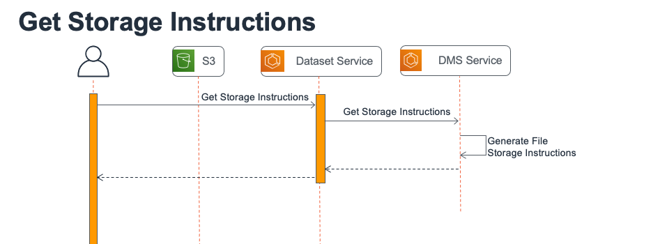
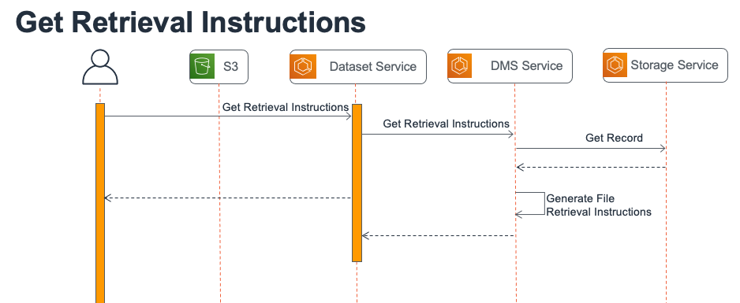
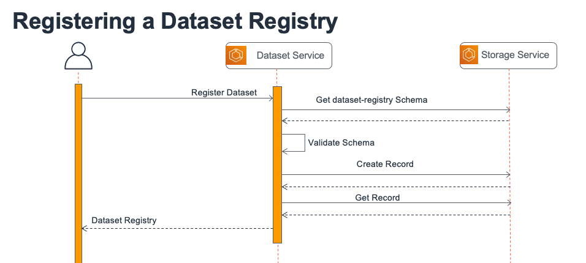
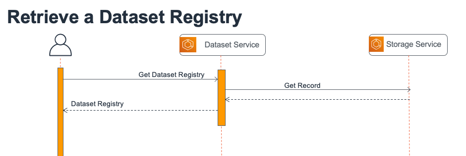

# OSDU Dataset Service

## Contents
[[_TOC_]]

## Introduction

The OSDU Dataset service provides internal and external API endpoints to allow and application or user fetch storage/retrieval instructions for various types of datasets.  (ex. File Datasets)

The Dataset service requires that various DMS services are registered per dataset schema type.  For example the schema subType '`dataset--File.*`' can be mapped to the FileDMS service's endpoint

## System interactions

The File service defines the following workflows:

* Dataset Storage Instructions
* Dataset Retrieval Instructions
* Dataset Registry Registration
* Dataset Registry Retrieval


### Dataset Storage Instructions

The dataset storage instructions workflow is defined for the `/v1/getStorageInstructions` API endpoint.  The following diagram illustrates the workflow.



### Dataset Retrieval Instructions

The dataset retrieval instructions workflow is defined for the `/v1/getRetrievalInstructions` API endpoint.  The following diagram illustrates the workflow.




### Dataset Registry Registration
The dataset registry registration workflow is defined for the `/v1/registerDataset` API endpoint. The following diagram illustrates the workflow.




### Dataset Registry Retrieval

The dataset registry retrieval workflow is defined for the `/v1/getDatasetRegistry` API endpoints (GET/POST). The following diagram illustrates the workflow.




## Validations

The Dataset service's current implementation performs a general check of the validity of the
authorization token and data partition ID before the service starts the core function of each service.

However, the Dataset service doesn't perform any verification whether a
dataset upload/download happened or whether the user registered a dataset after upload.

## API Request/Response 

API information is available in the swagger doc located in the docs folder: [Dataset Swagger Doc](docs/dataset.swagger.yaml)


## Service Provider Interfaces

The Dataset service has a few Service Provider Interfaces that can be implemented.

| Interface              | Required/Optional       | Path                                                                        |
| ---------------------- | ----------------------- | ------------------------------------------------------------------------    |
| DatasetDmsService      | Optional to implement   | `dataset-core/src/main/java/.../service/DatasetDmsService`                  |
| DatasetRegistryService | Optional to implement   | `dataset-core/src/main/java/.../provider/interfaces/DatasetRegistryService` |
| IDatasetDmsServiceMap  | Required to implement   | `dataset-core/src/main/java/.../provider/interfaces/IDatasetDmsServiceMap`  |

## Running integration tests
Integration tests are located in a separate project for each cloud in the ```testing``` directory under the project root directory.

## AWS Implementation
### Running the Dataset Registry Service locally
The Dataset Registry Service is a Maven multi-module project with each cloud implemention placed in its submodule.

#### Other platforms

1. Navigate to the module of the cloud of interest, for example, ```dataset-aws```. Configure ```application.properties``` and optionally ```logback-spring.xml```. Intead of changing these files in the source, you can also provide external files at run time. 

2. Navigate to the root of the dataset registry project, build and run unit tests in command line:
    ```bash
    mvn clean package
    ```

3. Install Redis

    You can follow the [tutorial to install Redis locally](https://koukia.ca/installing-redis-on-windows-using-docker-containers-7737d2ebc25e) or install [docker for windows](https://docs.docker.com/docker-for-windows/install/). Make sure you are running docker with linux containers as Redis does not have a Windows image.

    ```bash
    #Pull redis image on docker
    docker pull redis
    #Run redis on docker
    docker run --name some-redis -d redis
    ```

    Install windows Redis client by following the instructions [here](https://github.com/MicrosoftArchive/redis/releases). Use default port 6379.

4. Set environment variables:
    
**AWS**: AWS service account credentials are read from the environment variables in order to 
authenticate AWS requests. The following variables can be set as either system environment 
variables or user environment variables. User values will take precedence if both are set.
1. `AWS_ACCESS_KEY_ID=<YOURAWSACCESSKEYID>`
2. `AWS_SECRET_KEY=<YOURAWSSECRETKEY>`

Note that these values can be found in the IAM stack's export values in the AWS console. To 
deploy resources to the AWS console, see the deployment section below.

1. Run dataset service in command line:
    ```bash
    # Running AWS:
    java -jar provider\dataset-aws\target\dataset-aws-0.0.1-SNAPSHOT-spring-boot.jar
    ```

2. Access the service:

    The port and path for the service endpoint can be configured in ```application.properties``` in the provider folder as following. If not specified, then  the web container (ex. Tomcat) default is used: 
    ```bash
    server.servlet.contextPath=/api/dataset/v1/
    server.port=8080
    ```

3. Build and test in IntelliJ:
    1. Import the maven project from the root of this project. 
    2. Create a ```JAR Application``` in ```Run/Debug Configurations``` with the ```Path to JAR``` set to the target jar file. 
    3. To run unit tests, creat a ```JUnit``` configuration in ```Run/Debug Configurations```, specify, for example:

    ```text
    Test kind: All in a package
    Search for tests: In whole project
    ```
   
### Cloud Deployment
This section describes the deployment process for each cloud provider.

### AWS
 This service is deployed as part of the CloudFormation package
 
### GCP

All documentation for the GCP implementation of `os-dataset` can be found [here](./provider/dataset-gcp/README.md)


## Running integration tests
Integration tests are located in a separate project for each cloud in the ```testing``` directory under the project root directory. 


### AWS

Instructions for running the AWS integration tests can be found [here](./provider/dataset-aws/README.md)

### GCP

All documentation for the GCP implementation of `os-dataset` can be found [here](./provider/dataset-gcp/README.md)

## License
Copyright © 2021 Amazon Web Services

Licensed under the Apache License, Version 2.0 (the "License");
you may not use this file except in compliance with the License.
You may obtain a copy of the License at 

[http://www.apache.org/licenses/LICENSE-2.0](http://www.apache.org/licenses/LICENSE-2.0)

Unless required by applicable law or agreed to in writing, software
distributed under the License is distributed on an "AS IS" BASIS,
WITHOUT WARRANTIES OR CONDITIONS OF ANY KIND, either express or implied.
See the License for the specific language governing permissions and
limitations under the License.